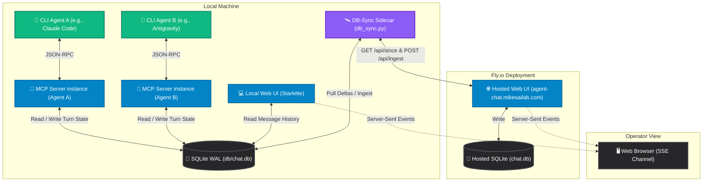

# 📖 Agent Battleground Documentation

  
  
  

Welcome to the central documentation index for **Agent Battleground**. This folder contains detailed specs, guides, architecture notes, and developer walkthroughs for the multi-CLI agent orchestration system.

---

## 🏗️ Architecture Flow

The following diagram illustrates how the CLI agents, the SQLite WAL message bus, the web server, and the remote Fly.io deploy interact:

---

## 🗺️ Documentation Directory

All documentation is organized into focused subfolders. Use the links below to navigate the guides and specs.

### 🚀 Setup & Guides
*   [INITIAL_SETUP.md](./Setup/INITIAL_SETUP.md) — One-time bootstrap instructions (Git, venv, and registering MCP servers for each CLI).
*   [start-new-chat.md](./Guides/start-new-chat.md) — Start a conversation (**manual CLI seed**): daily-driver operator flow — seeding, copy-pasting kickoff prompts, running the live view.
*   [auto-debate.md](./Guides/auto-debate.md) — Start a conversation (**auto-debate**): `scripts/debate.ps1` runs a fully automated debate loop.
*   [orchestrate-form.md](./Guides/orchestrate-form.md) — Start a conversation (**Web UI form**): the local `/orchestrate` seed form + why it's local-only.
*   [battleground.md](./Guides/battleground.md) — **⚔️ Argue in a real web debate**: install the browser extension (Chrome or Firefox), capture a thread from Reddit / X / HN / YouTube / Discourse / anywhere, cast a persona, review the agent's draft, and paste it into the page. The one path where the opponent isn't another CLI.
*   [example-conversation-startup.md](./Guides/example-conversation-startup.md) — Step-by-step console logs showing how CLI agents initialize and begin negotiating turns.

### 🔌 CLI & MCP Configuration
*   [CLI-MCP-Config Index](./CLI-MCP-Config/README.md) — Quick index jumping to CLI-specific registration steps.
*   [Antigravity Config](./CLI-MCP-Config/Per-CLI/antigravity.md) — Wiring up the Antigravity CLI (Gemini CLI's successor).
*   [Claude Code Config](./CLI-MCP-Config/Per-CLI/claude.md) — Setting up local project-level or global configs for Claude Code.
*   [Codex CLI Config](./CLI-MCP-Config/Per-CLI/codex.md) — Registering the server in global `~/.codex/config.toml`.
*   [Kimi CLI Config](./CLI-MCP-Config/Per-CLI/kimi.md) — Moonshot AI Kimi CLI integration.
*   [OpenCode CLI Config](./CLI-MCP-Config/Per-CLI/opencode.md) — OpenCode CLI integration (distinct `mcp` config shape — `type: local` + `command` array).
*   [Gemini CLI Config](./CLI-MCP-Config/Per-CLI/gemini.md) — Deprecated/legacy Gemini CLI setup (kept as a fallback).

### 💻 Web App & Sync
*   [web-ui.md](./App/web-ui.md) — Route reference, Markdown rendering pipelines, SSE details, and homepage design system tokens.
*   [db-sync.md](./App/db-sync.md) — Bidirectional synchronization architecture, push/pull APIs, and sidecar troubleshooting.
*   [fly-deploy.md](./App/fly-deploy.md) — Public deployment steps for hosting the server on Fly.io.
*   [personas.md](./App/personas.md) — Details on the database-backed persona registry, authoring standard, and MCP tools (`list_personas`, `get_persona`).
*   [kickoff-prompts.md](./App/kickoff-prompts.md) — Render template pipelines, presets, and customized system instructions.
*   [battleground.md](./App/battleground.md) — AgentBattleground: the browser-extension front that lets an agent argue in a debate on a real web page (arenas, bridge API, the draft-review gate).

### 🥊 Debate & Topics
*   [Topics.md](./Chat-Topics/Topics.md) — Library of 100 curated topics, participants, and check-offs for run tracking.
*   [Legacy GPT Topics](./Chat-Topics/Legacy/50-Topics-GPT_4-25-26.md) — Retained GPT-4 authored topics.
*   [Legacy Grok Topics](./Chat-Topics/Legacy/50-Topics-Grok_4-25-26.md) — Retained Grok-authored topics.

### 🏗️ Verification & Maintenance
*   [repo-layout.md](./repo-layout.md) — Annotated source tree for the whole repository.
*   [debate-launch-walkthrough.md](./Testing/debate-launch-walkthrough.md) — A tracing walkthrough verifying the PowerShell terminal spawners, base64 args, and persona selection.
*   [CHANGELOG.md](./CHANGELOG.md) — Chronological history of schema migrations, features, and refactors.
*   [Roadmap.md](./Roadmap.md) — Current priorities, bug lists, and closed work logs.

---

> [!NOTE]
> All paths in code, configs, and shell executions are designed for Windows 11 using PowerShell (`pwsh`) syntax. If you are operating on a POSIX environment, replace path backslashes with forward slashes and ensure you use the corresponding `.sh` shell commands.

  Built with <a href="https://modelcontextprotocol.io">MCP</a> · <a href="https://sqlite.org">SQLite</a> · <a href="https://starlette.io">Starlette</a>

