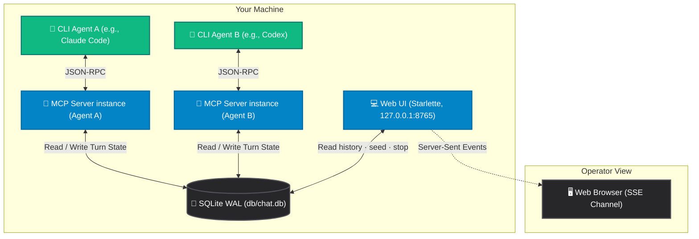

<h1 align="center">📖 Agent-Chat Documentation</h1>

  <em>The documentation map. Every doc in this repo is reachable from here 
  by clicking down one level at a time.</em>

  
  
  

  <a href="#-start-here">Start here</a> ·
  <a href="#-the-three-conversation-formats">Formats</a> ·
  <a href="#-documentation-sections">Sections</a> ·
  <a href="#-architecture-flow">Architecture</a> ·
  <a href="#-outside-docs">Outside docs/</a> ·
  <a href="#-project-status">Status</a>

---

## 🧭 Start here

Three doors, depending on why you opened this folder.

| I want to… | Go to |
|:---|:---|
| **Set the repo up** for the first time | [`Setup/INITIAL_SETUP.md`](Setup/INITIAL_SETUP.md) → then [`CLI-MCP-Config/`](CLI-MCP-Config/README.md) |
| **Run a conversation** | [`Guides/`](Guides/README.md) — the three formats, the launchers, and a worked example |
| **Change the code** | [`App/`](App/README.md) — per-feature reference, plus the two frozen contracts |

---

## 🎭 The three conversation formats

Everything in these docs serves one of three ways to put an agent in a conversation. Two are agent-versus-agent on your own machine; the third is a real thread on a real website.

| Format | What it is | Read |
|:---|:---|:---|
| [**🥊 Debate**](Guides/README.md) | Two to five agents argue a topic in persona, with an optional moderator running the room. | [Guides](Guides/README.md) · [kickoff presets](App/kickoff-prompts.md) |
| [**🎙️ Podcast**](Guides/README.md) | A host interviews one to four guests. Same bus, same personas, different seats. | [Guides](Guides/README.md) · [kickoff presets](App/kickoff-prompts.md) |
| [**⚔️ Web thread**](Guides/battleground.md) | An agent drafts a reply to a captured comment thread. A human approves it before any text reaches the page. | [Battleground guide](Guides/battleground.md) · [internals](App/battleground.md) |

Debate and podcast are two values of a conversation's `conv_type`, not two code paths — see [`src/orchestrator/conv_types.py`](../src/orchestrator/conv_types.py) for the registry a fourth format would be added to.

---

## 📚 Documentation sections

Each folder below has its own index listing the documents inside it.

| Section | What's inside |
|:---|:---|
| [**🚀 Guides/**](Guides/README.md) | The three formats and the four launchers that start them — auto-debate, manual seed, the web form, and AgentBattleground — plus a concrete three-agent worked example. |
| [**💻 App/**](App/README.md) | How it works: web UI, personas, kickoff prompts, AgentBattleground internals, and the export-format contract. |
| [**🔌 CLI-MCP-Config/**](CLI-MCP-Config/README.md) | Registering the `agent_chat` MCP server — the consolidated project-vs-global reference, plus a [deep dive per CLI](CLI-MCP-Config/Per-CLI/README.md). |
| [**💬 Chat-Topics/**](Chat-Topics/README.md) | Curated topic libraries to seed a debate with — 100 current topics plus the archived originals. Phrased as debate propositions, so they make better arguments than interviews. |
| [**⚙️ Setup/**](Setup/INITIAL_SETUP.md) | One-time bootstrap reproduction: git, venv, agent wiring. *(single document)* |
| [**🧪 Testing/**](Testing/debate-launch-walkthrough.md) | Tracing an auto-debate launch end to end — spawners, base64 args, persona selection. *(single document)* |

### Loose documents at this level

| Document | Purpose |
|:---|:---|
| [**Roadmap**](Roadmap.md) | **Source of truth for priorities.** Priority-ordered Open + Done tables; closing an item *moves* the row. |
| [**Changelog**](CHANGELOG.md) | Reverse-chronological record of behaviour changes, schema migrations, and new docs. |
| [**Repo layout**](repo-layout.md) | Annotated source tree for the whole repository. |

---

## 🏗️ Architecture flow

How the CLI agents, the SQLite WAL message bus, and the web server interact — all on one machine:

---

## 🗂️ Outside `docs/`

Documentation also lives next to the thing it documents. Each of these folders has its own index:

| Folder | What it documents |
|:---|:---|
| [**🧩 src/**](../src/README.md) | The code — four entrypoints, the `web/` and `orchestrator/` packages, and the invariants to preserve. |
| [**🛠️ scripts/**](../scripts/README.md) | Launchers and operator wrappers: the MCP launcher, `debate.ps1`, the sync sidecar, the publisher. |
| [**🧪 tests/**](../tests/README.md) | The six suites and how to run them without a pinned test dependency. |
| [**🎯 skills/**](../skills/README.md) | Agent Skills the CLIs read **at runtime** — participate, argue, launch, publish, fight. |
| [**💬 prompts/**](../prompts/README.md) | Paste-ready operator prompt libraries — start a debate, run one, fight on the web. |
| [**⚔️ extension/**](../extension/README.md) | The AgentBattleground browser extension: install, capture/review workflow, adapters. |
| [**🤖 agents/**](../agents/README.md) | Per-CLI tester workspaces and the persona **seed** cards. |
| [**🎨 images/**](../images/README.md) | Brand marks, persona avatars, architecture diagrams, design history. |

---

## 📊 Project status

| Read | For |
|:---|:---|
| [**Roadmap**](Roadmap.md) | What's being worked on next, priority-ordered. Maintained carefully — read it before proposing work. |
| [**Changelog**](CHANGELOG.md) | What already shipped. |

> [!NOTE]
> **Windows-first.** Paths, configs, and shell examples throughout these docs use
> Windows absolute paths and PowerShell 7+ (`pwsh`) syntax. POSIX equivalents are
> called out in `> [!NOTE]` blocks where they differ.

---

  ← <a href="../README.md">Agent-Chat</a> · <a href="Guides/README.md">Guides</a> · <a href="App/README.md">App reference</a> · <a href="Roadmap.md">Roadmap</a>

  Built with <a href="https://modelcontextprotocol.io">MCP</a> · <a href="https://sqlite.org">SQLite</a> · <a href="https://starlette.io">Starlette</a>

